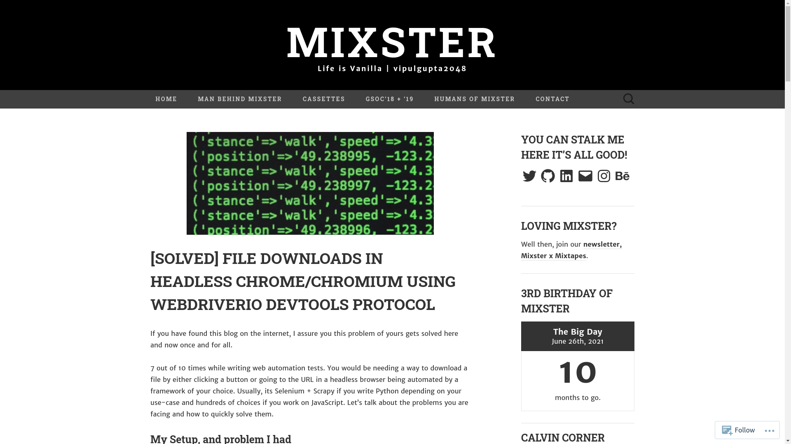

# File Downloads Demo with WebdriverIO

Since, there is no one way to make file downloads work in WebdriverIO with headless chromium using the Devtools protocol, I wrote about a blog post detailing what worked for me along with the sample code hosted on this repository. 

For any questions, you can reach out to me on [Twitter](https://twitter.com/vipulgupta2048) or [comment down on the post](https://mixstersite.wordpress.com/2020/08/13/file-download-headless-chrome-chromium-webdriverio-devtools-chromedriver/) and I would reply under a day or so. Toodles and hope this solves your issue.  
